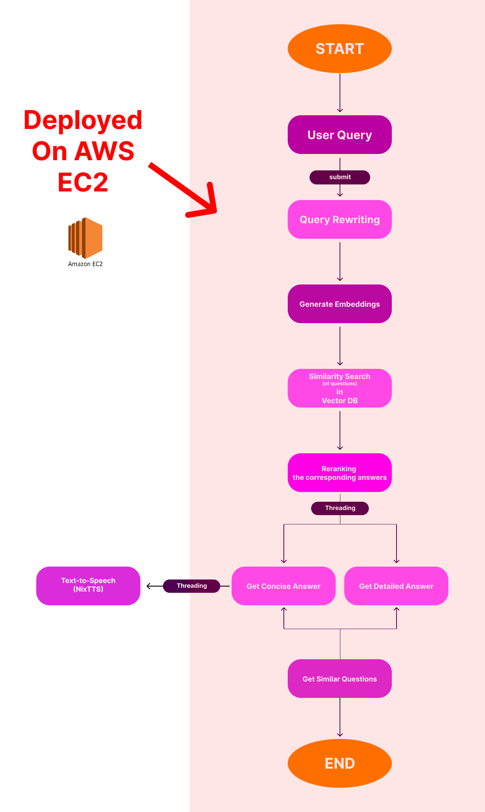

# SARAS AI INSTITUTE - Smart FAQ Query System

Link to Access(w/o TTS) : [Smart FAQ Query System](http://ec2-54-159-96-209.compute-1.amazonaws.com:8501)

This project is a **Smart FAQ Module** for the SARAS AI Institute website, designed to enhance user experience by delivering precise, immediate answers to user queries based on the FAQ database. Leveraging **OpenAI**, **FAISS**, and **NixTTS**, this module returns concise and detailed responses and can also convert responses to audio using Text-to-Speech (TTS).

## Table of Contents
- [Features](#features)
- [Technologies Used](#technologies-used)
- [Setup Instructions](#setup-instructions)
- [Usage](#usage)
- [File Structure](#file-structure)
- [License](#license)

## Features
- **Natural Language Understanding**: Uses OpenAI's language models to understand and interpret user queries.
- **Similarity Search**: Employs FAISS for fast and accurate similarity matching with the FAQ database.
- **Query Rewriting**: Enhances the clarity and relevance of user queries for better search results.
- **Concise & Detailed Responses**: Provides both quick and in-depth answers based on user preference.
- **Text-to-Speech (TTS) Option**: Converts the concise response to audio using NixTTS for added accessibility (optional).
- **User-Friendly Interface**: A clean, intuitive interface for easy interaction.
- **ADDED FEW MORE Questions**: For robustness.

## Technologies Used
- **OpenAI**: For natural language processing and embeddings.
- **FAISS**: For efficient similarity search on the FAQ database.
- **Streamlit**: For building a responsive web interface.
- **NixTTS**: For converting text responses to audio.
- **pyaudio & wave**: For audio playback in the TTS version.
- **Python**: Primary programming language for backend logic.

## Workflow Diagram



## Setup Instructions

1. **Clone the repository**:
   ```bash
   git clone https://github.com/yourusername/SmartFAQSystem.git
   cd SmartFAQSystem
   ```
2. **Install dependencies**: Make sure you have Python 3.8+ and pip installed.
    ```bash
   pip install -r requirements.txt
   ```
3. **Set up OpenAI API Key**:
    - Sign up on OpenAI and get your API key.
    - Sign up on OpenAI and get your API key

    ```bash
    OPENAI_API_KEY ="Your-API-Key"
    ```

4. **Run the Application** :
    - Without TTS:
        ```bash
        streamlit run app.py
        ```
    - With TTS:
        - Make sure you have cuda installed. [Guide](https://youtu.be/nATRPPZ5dGE?si=rlO_a1ETe5AyXWQg)
        - Install Espeak 
            - Go to [espeak-ng](https://github.com/espeak-ng/espeak-ng/releases)
            - Scroll down to assets
            - Do the Setup
            - Make sure you add paths to environment variablles
                ```bash
                PHONEMIZER_ESPEAK_PATH: c:\Program Files\eSpeak NG
                PHONEMIZER_ESPEAK_LIBRARY: c:\Program Files\eSpeak NG\libespeak-ng.dll
                ```
            - install Pytorch
                ```bash
                pip3 install torch torchvision torchaudio --index-url https://download.pytorch.org/whl/cu121
                ```
        Run this file

        ```bash
        streamlit run app_voice.py
        ```
5. **Access the deployed App**:
    [SMART_FAQ_SYSTEM](http://ec2-54-159-96-209.compute-1.amazonaws.com:8501)

## Usage
1. **Enter Your Question**: Open the app in your browser and type your question in the input box.
2. **Click "Submit"**: After entering your question, click the "Submit" button.
3. **View the Results**:
   - The app will process your question and display a **concise answer** and a **detailed answer** based on the FAQ database.
   - You’ll also see a list of **similar questions** related to your query.
4. **Listen to the Answer (TTS Version)**: 
   - In the version with Text-to-Speech (TTS), the concise answer will be played as audio, providing an accessible option for auditory learners.
   - The audio playback is processed in chunks for efficiency and clarity.

## File Structure
```ruby
SARCATHON/
│
├── app_voice.py             # Main app file with TTS feature
├── app.py          # Main app file without TTS
├── faqs.json                   # JSON file containing FAQ data
├── faq_index.faiss             # FAISS index file for similarity search
├── questions.npy               # Numpy file containing question embeddings
├── answers.npy                 # Numpy file containing answer embeddings
├── requirements.txt            # List of dependencies
├── .env                        # Environment variables file for API keys
└── README.md                   # Project documentation

└──fastapi_code.py     # Code for deploying , So that can be used for future advancement. [FAST API]
└──index_faq.py        # Code for creating index
└──ignore rest 
```

## License
This project is licensed under the MIT License. See the [LICENSE](LICENSE) file for more details.


